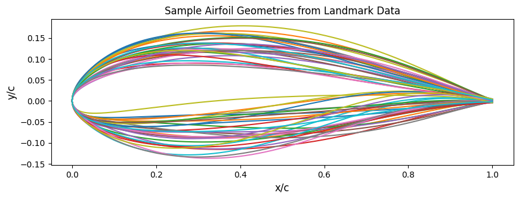
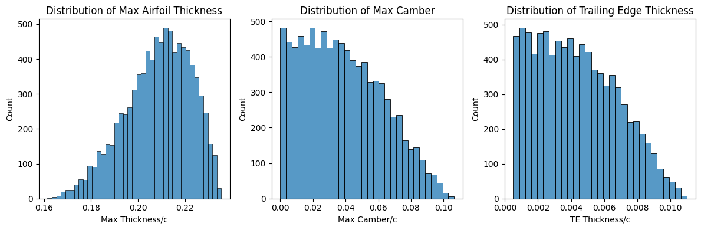
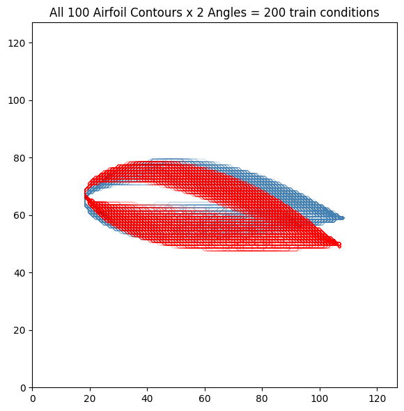
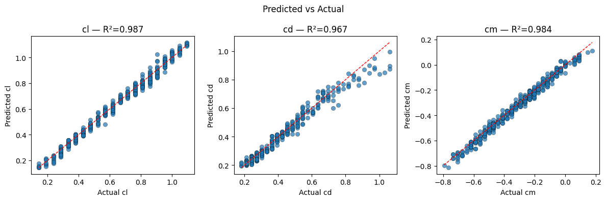
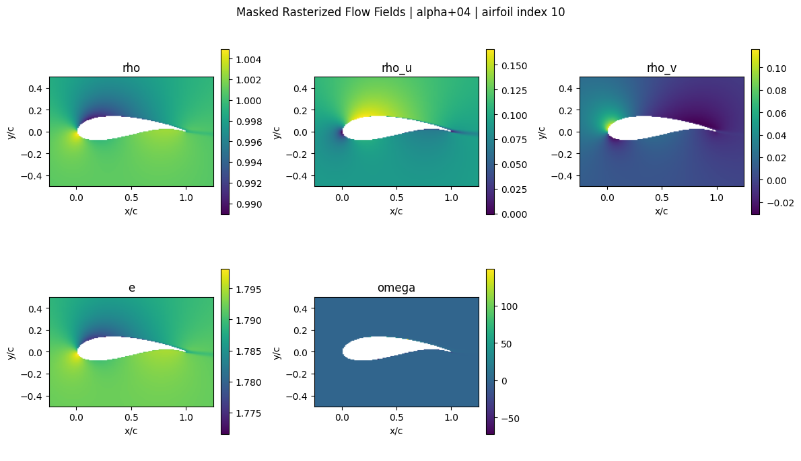
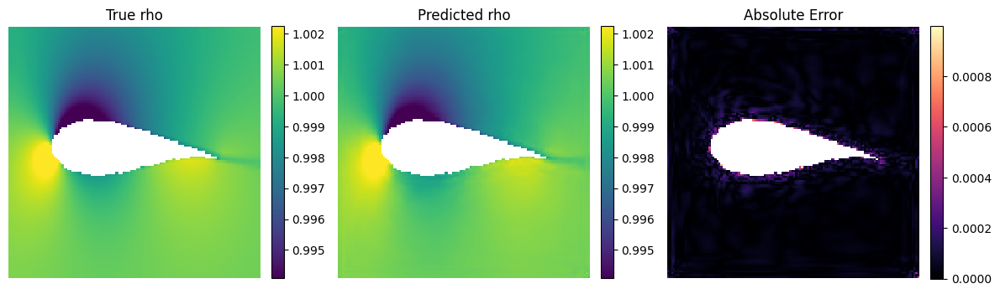

# Airfoil Transformer Workspace

This workspace is an experimentation environment for building surrogate models for 2D airfoil simulations. The main working document is [`explore_airfoil_9k_data.ipynb`](explore_airfoil_9k_data.ipynb), which walks through dataset inspection, preprocessing, CNN coefficient prediction, U-Net flow-field prediction, thin-airfoil benchmarking, and interactive drawing tests.

The surrounding Python files are mostly utilities, visualization helpers, and lightweight interfaces that support the notebook workflow.

## Project Focus

The project uses the NREL/DOE Airfoil Computational Fluid Dynamics dataset, which contains generated airfoil shapes at 4 and 12 degree angles of attack. The notebook experiments with two related surrogate-modeling tasks:

- Predict aerodynamic coefficients: `Cl`, `Cd`, and `Cm` from rasterized airfoil geometry.
- Predict spatial flow fields: density, momentum, and energy fields around an airfoil using a U-Net-style model.

The current workflow emphasizes fast experimentation over a packaged production API. Most modeling decisions, plots, and observations live in the notebook.

## Main Experiment Notebook

[`explore_airfoil_9k_data.ipynb`](explore_airfoil_9k_data.ipynb) is the central experiment setup.

It includes:

- HDF5 dataset exploration and downsizing from the full CFD dataset.
- Airfoil landmark, Grassmann, CST, and Bezier parameterization inspection.
- Conversion of airfoil outlines into fixed-size 128 x 128 raster grids.
- CNN training for aerodynamic coefficient prediction.
- Keras Tuner experiments and normalized target metrics.
- Evaluation of baseline, tuned, and VGG-style CNN models.
- Interactive drawn-airfoil tests.
- Thin-airfoil theory benchmarking.
- U-Net flow-field preprocessing, training, and visualization.
- Gradio app testing and 9k dataset exploration notes.

Use this notebook first when trying to understand or extend the project.

## Example Airfoil Inputs

These sample airfoil drawings are used by the app and are useful visual references for the raster-input workflow.

<p>
  
  
  
</p>

## Notebook Generated Visuals

The main notebook also contains generated plots and flow maps from the experimentation process. A curated set has been extracted into `docs/images/` for easier viewing in this README.

### Airfoil Geometry Exploration





### Rasterized Training Inputs



### CNN Coefficient Model Evaluation



### Flow-Field Maps and U-Net Results





## Workspace Map

| Path | Role |
| --- | --- |
| `explore_airfoil_9k_data.ipynb` | Main experimentation notebook for data exploration, model training, evaluation, and observations. |
| `airfoil_utils.py` | Core utility library for loading HDF5 data, processing geometry, rasterizing landmarks, gridding flow fields, plotting, model evaluation, and rotating flow datasets. |
| `raster_airfoil.py` | Converts binary raster masks back into ordered airfoil `x, y` contours and normalizes orientation. |
| `thin_airfoil.py` | Modified thin-airfoil-theory benchmark for estimating `Cl`, `Cd`, and quarter-chord moment from contour points. |
| `thin_airfoil_example.py` | Convenience comparison helper for checking a rasterized airfoil against dataset coefficients. |
| `airfoil_canvas_widget.py` | Jupyter/IPython canvas widget for drawing airfoils and predicting aerodynamic coefficients. |
| `airfoil_canvas_widget_with_flow.py` | Notebook canvas widget extended with flow-field prediction preview. |
| `airfoil_canvas_widget_with_flow_v2.py` | Later notebook widget iteration with flow-field utilities. |
| `airfoil_canvas_widget_with_flow_v3.py` | Newer notebook widget iteration with additional flow-preview behavior. |
| `airfoil_gradio_app.py` | Standalone Gradio interface for drawing/selecting airfoils, predicting coefficients, estimating angle of attack, and visualizing predicted flow fields. |
| `examples/` | Preset airfoil images used by the Gradio app gallery. |
| `docs/images/` | Selected plots and generated maps extracted from the main notebook for README display. |
| `models/` | Saved Keras models from coefficient and flow-field experiments. |
| `data/` | Local HDF5 data artifacts, including downsized datasets and raster/flow grids. |
| `kt_results/` | Keras Tuner output for CNN hyperparameter experiments. |
| `references/` | Scratch/reference notebooks and demos. |

## Data Artifacts

The local `data/` folder contains generated or downsized HDF5 files used by the notebook:

- `airfoil_1k_data_rng.h5`: downsized randomized airfoil dataset.
- `airfoil_1k_grid_128.h5`: 128 x 128 rasterized airfoil geometry grids.
- `airfoil_1k_flow_grid_128.h5`: gridded flow-field data.
- `airfoil_1k_rotated_nanmask_inputs_128.h5`: rotated/masked flow-model inputs.
- `test_flow_grid_128.h5`: smaller flow-grid test artifact.

The notebook references the original dataset source:

https://catalog.data.gov/dataset/airfoil-computational-fluid-dynamics-9k-shapes-2-aoas

## Saved Models

The `models/` directory stores trained Keras models from several experiment passes:

- CNN coefficient models, including baseline and tuned variants.
- VGG-style coefficient models, including `airfoil_vgg16_best1_1k.keras`.
- U-Net flow-field models, including `airfoil_unet_all_fields.keras`.

The Gradio app expects these two model files by default:

- `models/airfoil_vgg16_best1_1k.keras`
- `models/airfoil_unet_all_fields.keras`

## Running the Workspace

Open the main notebook:

```bash
jupyter notebook explore_airfoil_9k_data.ipynb
```

Run the interactive Gradio demo:

```bash
python3 airfoil_gradio_app.py
```

Common dependencies used across the notebook and app include:

```text
numpy
pandas
matplotlib
seaborn
h5py
dask
scipy
scikit-learn
scikit-image
tensorflow
keras-tuner
gradio
pillow
ipywidgets
ipycanvas
plotly
altair
rounders
```

## Suggested Workflow

1. Start in `explore_airfoil_9k_data.ipynb` to understand the dataset, model experiments, and current conclusions.
2. Use `airfoil_utils.py` for reusable data loading, gridding, plotting, and evaluation functions.
3. Use `raster_airfoil.py` and `thin_airfoil.py` when comparing raster-model behavior against a physics-inspired baseline.
4. Use the canvas widget files for notebook-based interactive tests.
5. Use `airfoil_gradio_app.py` for a standalone drawing and visualization interface.

## Notes

- The notebook is the source of truth for the experimental narrative.
- The Python files are support modules and demo interfaces rather than a formal package.
- Some files are experiment iterations or backups, so prefer the newest named versions when testing notebook widgets.
- Large HDF5 and Keras artifacts may be specific to this local workspace.
